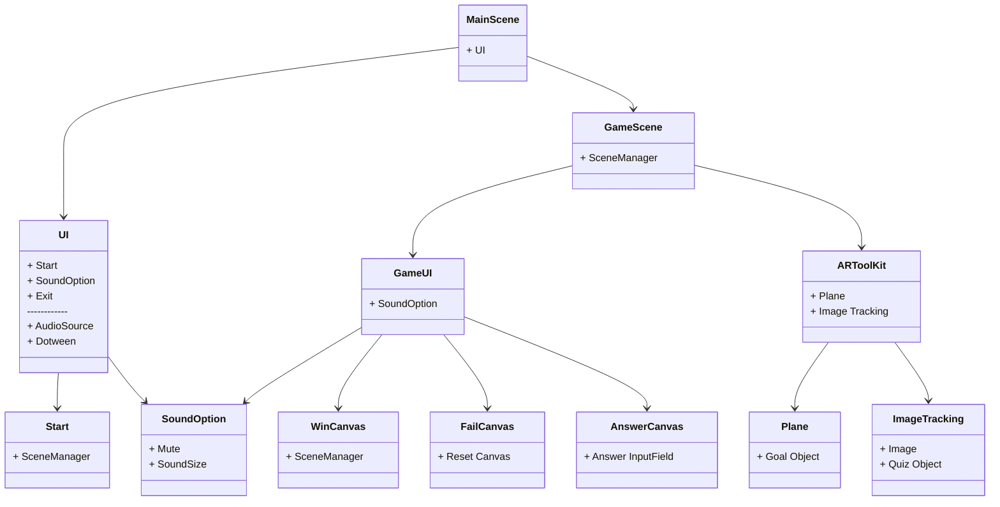

# Find Answer

개발 환경: Window10+, Mac Ventura
개발툴: Unity 2021.03.26f1
게임 이름: Find Answer
게임 장르: AR 퀴즈게임
기획 의도: 여러명이서 AR을 통해 간편하게 방탈출느낌의 즐거운 퀴즈게임을 즐깁니다.
작업 기간: 2023.06.03 ~ 2023.06.05
프로젝트 완료일: 2023년 6월 5일
플랫폼: Android, Ios


## 프로젝트 기획

[Find Answer.pdf](Find%20Answer%20c7450cfee1a6457f9c59ae0a785f6d42/Find_Answer.pdf)


## 사용 에셋

### 1. 기능

- DOTween Pro
- Editor Console Pro
- Grabbit - Editor Physics Transforms
- Rainbow Folders 2
- Rainbow Hierarchy 2
- Odin Inspector and Serializer

### 2. 모델링,사운드,이펙트

- DOMESTIC ANIMALS PACK 2
- Game Music Stingers and UI SFX 2 Pack

## 주요씬 구성 및 기능도



## **기능 구현 파트**

### GameManager

```csharp
using System.Collections;
using System.Collections.Generic;
using UnityEngine;

public class GameManager : MonoBehaviour
{
    public static GameManager instance;
    public float soundSize;
    public bool isMute = false;

    //사운드사이즈 값을 씬마다 변동되는것을 막기위해 싱글톤화 했습니다.
    void Awake(){
        if(instance == null){
            instance = this;
            DontDestroyOnLoad(this);
        }
        Destroy(this);
    }
    //SoundManager스크립트에서 변동이 생길시 게임매니저에서 사운드를 적용합니다.
    public void SoundChange(){
        AudioListener.volume = soundSize;
    }

    //SoundManager스크립트에서 음소거 여부를 변수에 변동이 생기면 게임매니저에서 사운드를 적용합니다.
    public void MuteSound(){
        AudioListener.pause = isMute;
    }
}
```

### UIManager

```csharp
using System.Collections;
using System.Collections.Generic;
using UnityEngine;
using UnityEngine.SceneManagement;

public class UIManager : MonoBehaviour
{
    public string currentScene;
    public float maxTime = 3;
    public CanvasGroup optionCanvas;
    public Canvas uiCanvas;

    bool canClick = false;
    bool isOption;
    
    //현재씬이 메인씬이면, 게임시작버튼 작동을 maxtime이후에 가능하게합니다.(애니메이션과 동기화)
    void Start(){
        currentScene = SceneManager.GetActiveScene().name;
        
        if(currentScene == "Main"){
            Invoke("CanClick", maxTime);
        }
    }
    //Invoke로 통제하기위해 림다식으로 간단히 구성했습니다.
    void CanClick() => canClick = true;

    //씬 변경 버튼마다 여러개의 스크립트 작성을 막기위해, 씬번호를 넣도록만들었습니다.
    public void OnChangeScene(int sceneNumber){
        if(canClick){
            SceneManager.LoadScene(sceneNumber);
        }
    }

    //옵션버튼을 눌렸을때, 옵션창이 켜져있으면 꺼지게되고, 꺼져있으면 켜지게 됩니다.
    public void OnOptionBTN(){
        if(!isOption){
            if(uiCanvas != null){
                uiCanvas.gameObject.SetActive(false);
            }
            optionCanvas.gameObject.SetActive(true);
            isOption = true;
        }

        else if(isOption){
            if(uiCanvas != null){
                uiCanvas.gameObject.SetActive(true);
            }
            optionCanvas.gameObject.SetActive(false);
            isOption = false;
        }
    }
}
```

### SoundManager

```csharp
using System.Collections;
using System.Collections.Generic;
using UnityEngine;
using UnityEngine.UI;
using TMPro;
using UnityEngine.SceneManagement;
using Sirenix.OdinInspector;

public class SoundManager : MonoBehaviour
{
    [Title("Info")]
    public Slider soundSlider;
    public TMP_InputField soundInput;
    public float soundSize;
    public Sprite[] soundSprites;
    public Image soundImage;

    AudioSource audio;

    void Awake(){
        audio = GetComponent<AudioSource>();
    }

    //슬라이더값에 변동이 생기면 뮤트여부이미지와 사운드사이즈텍스쳐에 값을 전달합니다.
    public void SoundSizeSilder(){
        soundSize = soundSlider.value;
        soundInput.text = soundSize.ToString();

        IsMute();
    }

    //사운드사이즈텍스쳐에 변동이 생기면 뮤트여부이미지와 슬라이더값에 값을 전달합니다.
    public void SoundController(){
        soundSize = float.Parse(soundInput.text);
        soundSlider.value = soundSize;
        IsMute();
    }

    //사운드를 실제적으로 조정합니다. AudioLisener를 조절하기떄문에, 변수값을 1로 기준을 잡았습니다.
    void IsMute(){
        GameManager.instance.soundSize = (soundSize / 100f);

        //무음여부에따라 무음이미지를 변경합니다.
        if(soundSize <= 0){
            GameManager.instance.isMute = true;
            soundImage.sprite = soundSprites[1];
        }
        else if(soundSize > 0){
            GameManager.instance.isMute = false;
            soundImage.sprite = soundSprites[0];
        }

        GameManager.instance.MuteSound();
        GameManager.instance.SoundChange();
    }

    //무음 여부에 따라 무음 이미지를 변경하고, 사운드를 무음화 시킵니다.
    public void OnMuteButton(){
        if(GameManager.instance.isMute == false){
            GameManager.instance.isMute = true;
            soundImage.sprite = soundSprites[1];
        }
        else if(GameManager.instance.isMute == true){
            GameManager.instance.isMute = false;
            soundImage.sprite = soundSprites[0];
        }
        GameManager.instance.MuteSound();
    }    
}
```

### ImageTracking

```csharp
using System.Collections;
using System.Collections.Generic;
using UnityEngine;
using Sirenix.OdinInspector;
using UnityEngine.XR.ARFoundation;

//멀티 이미지 트레킹을 하는 스크립트입니다.
public class ImageTracking : MonoBehaviour
{

    private ARTrackedImageManager trackedImageManager;

    [SerializeField]
    private GameObject[] trackedObjects;
    private Dictionary<string, GameObject> spawnedObjects;
    public float offset = 90;

    void Awake(){
		//변수들을 초기화합니다. 이미지트레킹에 사용될 오브젝트를 미리생성한뒤 SetActive를꺼줍니다.
		//게임도중에 렉이 걸리는것을 방지할려고했습니다.
        trackedImageManager = GetComponent<ARTrackedImageManager>();
        spawnedObjects = new Dictionary<string, GameObject>();

        foreach(GameObject obj in trackedObjects){
            GameObject newObject = Instantiate(obj);
            newObject.name = obj.name;
            newObject.SetActive(false);

            spawnedObjects.Add(newObject.name, newObject);
        }
    }

    void OnEnable(){
        trackedImageManager.trackedImagesChanged += OnTrackedImageChanged;
    }

    void OnDisable(){
        trackedImageManager.trackedImagesChanged -= OnTrackedImageChanged;
    }

		//이미지가 새로추가되거나, 위치값이 변동되거나, 아예사라질경우 작동하는 스크립트입니다.
    void OnTrackedImageChanged(ARTrackedImagesChangedEventArgs eventArgs){
        foreach(ARTrackedImage trackedImage in eventArgs.added){
            UpdateSpawnObject(trackedImage);
        }
        foreach(ARTrackedImage trackedImage in eventArgs.updated){
            UpdateSpawnObject(trackedImage);
        }
        foreach(ARTrackedImage trackedImage in eventArgs.removed){
            spawnedObjects[trackedImage.name].SetActive(false);
        }
    }
    // 딕셔너리를 이용하여 맞는 오브젝트를 실행합니다(SetActive(true))
		// 이를 위해 딕셔너리 string값과 오브젝트의 이름을 똑같이 만들어주었습니다.
    
    void UpdateSpawnObject(ARTrackedImage trackedImage){
        Quaternion quaternion = Quaternion.identity;
        string referImageName = trackedImage.referenceImage.name;
        spawnedObjects[referImageName].transform.position = trackedImage.transform.position;
        spawnedObjects[referImageName].transform.rotation =  trackedImage.transform.rotation;
        spawnedObjects[referImageName].transform.Rotate(trackedImage.transform.rotation.x + offset, trackedImage.transform.rotation.y, trackedImage.transform.rotation.z);

        spawnedObjects[referImageName].SetActive(true);
    }
}
```

### PlaneAR

```csharp
using System.Collections;
using System.Collections.Generic;
using UnityEngine;
using UnityEngine.XR.ARFoundation;
using UnityEngine.XR.ARSubsystems;

public class PlaneAR : MonoBehaviour
{
    public GameObject gameObject;
    ARRaycastManager arRaycastManager;
    List<ARRaycastHit> hits = new List<ARRaycastHit>();
    bool madeGoal = false;
   

    ARPlaneManager arPlane;

    void Start(){
        arRaycastManager = GetComponent<ARRaycastManager>();
        arPlane = GetComponent<ARPlaneManager>();
    }

    //처음 Plane포인트 위치에 오브젝트를 생성합니다. 목표물인 CageCat을 바닥에 생성해두기위한 스크립트입니다.
    //실행될시 게임이 준비되었다는 madeGoal을 true로합니다.
    void Update(){
        if(madeGoal == false){
            Vector3 centerPos = Camera.current.ViewportToScreenPoint(new Vector3(0.5f, 0.5f));
            
            arRaycastManager.Raycast(centerPos, hits, TrackableType.Planes);

            if(hits.Count > 0){
                Pose placePosition = hits[0].pose;
                gameObject.gameObject.SetActive(true);
                gameObject.transform.SetPositionAndRotation(placePosition.position, placePosition.rotation);
                madeGoal = true;
                Destroy(arRaycastManager);
                Destroy(arPlane);
            }
        } 
    }
}
```

### QuizController

```csharp
using System.Collections;
using System.Collections.Generic;
using UnityEngine;
using TMPro;
using UnityEngine.UI;
using Sirenix.OdinInspector;
using UnityEngine.SceneManagement;

public class QuizController : MonoBehaviour
{   
    [Title("UISetting")]
    public TMP_InputField answer1;
    public TMP_InputField answer2;
    public TMP_InputField answer3;
    public Canvas answerCanvas;
    public Canvas finishCanvas;
    public Canvas keyCanvas;
    public CanvasGroup wrongImage;
    public TextMeshProUGUI clearTimeText;
    public AudioSource audio;
    public ParticleSystem[] particleSystems;
    bool isAnswer =false;
    bool isWrong = false;
    bool isClear = false;
    float wrongTime;
    float maxTime = 2;
    float clearTime;

    [Title("cageCatController")]
    public GameObject cageCat;
    public GameObject cage;

    public Transform offset;
    Renderer renderer;
    float dessolveTime;
    bool isDessolve = false;

    private void Start() {
        renderer = cage.GetComponent<Renderer>();
    }
    private void Update() {
        CheckisWrong();
        ClearTimeCheck();
        DessolveCage();
    }
    //정답을 적을 캔버스를 띄웁니다.
    public void OnKeyBTN(){
        if(!isAnswer){
            answerCanvas.gameObject.SetActive(true);
            isAnswer = true;
        }
        else if(isAnswer){
            answerCanvas.gameObject.SetActive(false);
            isAnswer = false;
        }
    }
    //게임시작부터 계속 게임플레이 시간을 체크합니다.
    public void ClearTimeCheck(){
        if(!isClear){
            clearTime += Time.deltaTime;
        }
        else{
            clearTimeText.text = "Clear Time : " + clearTime;
        }   
    }
    //Wrong이미지를 2초간 띄운뒤 꺼집니다.
    void CheckisWrong(){
        if(isWrong && wrongTime > 0){
            wrongImage.gameObject.SetActive(true);
            wrongTime -= Time.deltaTime;
            wrongImage.alpha = Mathf.Lerp(0, maxTime, wrongTime);
        }
        else if(isWrong && wrongTime <= 0){
            wrongTime = maxTime;
            wrongImage.gameObject.SetActive(false);
            isWrong = false;
            wrongImage.alpha = 1;
        }
    }
    //정답을 눌렸을때, 작동합니다. 정답을 맞추면 승리캔버스가열리고, 오답시 답을 초기화하고 실패 스크립틀을 작동합니다
    public void OnSubmitBTN(){
        if(answer1.text == "숭례문" && answer2.text == "다이아몬드" && answer3.text == "바나나킥"){
            answerCanvas.gameObject.SetActive(false);
            finishCanvas.gameObject.SetActive(true);
            isClear = true;
            cageCat.transform.position = offset.transform.position;
            cageCat.transform.rotation = offset.transform.rotation;
            audio.Play();
            foreach(ParticleSystem part in particleSystems){
                part.Play();
            }
            keyCanvas.gameObject.SetActive(false);
            Invoke("Dessolve", 0.1f);
        }
        else {
            answer1.text = "";
            answer2.text = "";
            answer3.text = "";
            
            CheckisWrong();

            isWrong = true;
        }
    }
    // 디솔브를 시작유무를 결정합니다.
    void Dessolve(){
        isDessolve = true;
    }

    //메테이얼 변수를 통해 Dessolve를 실행합니다.
    void DessolveCage(){
        if(isDessolve){
            cageCat.transform.position = offset.transform.position;
            cageCat.transform.rotation = offset.transform.rotation;
            renderer.material.SetFloat("_DessolvePower", dessolveTime );
            dessolveTime += (Time.deltaTime / 10);
        }
    }
}
```

## **문제점 및 개선 방안**

1. QR이미지로 만든 이미지을 이미지트레킹시, QR들이 모두 같은 이미지로 인식되는 문제가있었습니다. 힌트가 될만한 이미지을 구해서 대체했습니다.
2. 질문지를 바닥에 놓고, 이미지트레킹시 사람이 보기 힘든 수직방향이 되어 수평으로 수정했습니다.

## **개선예정**

1. 좀더 다양한 이미지 와 수수께끼를 구성하는것도 좋은 방안일것같습니다.
2. Json과 딕셔너리를 이용해서 수많은 수수께끼와 정답을 관리하며, 랜덤으로 질문을 내는것도 좋을거같습니다.
